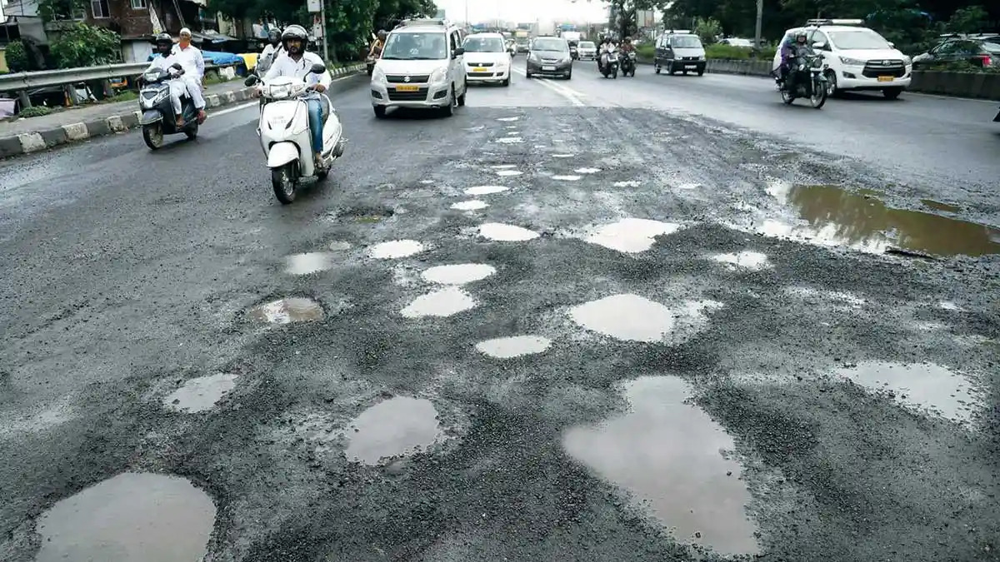
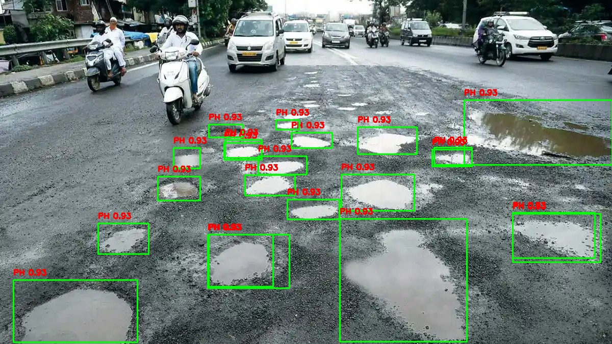

# GAIA: Ground Assessment and Identification Assistant

## Project Description

GAIA is an innovative pothole detection system designed to enhance road safety and infrastructure maintenance. By leveraging advanced technologies like YOLOv10, drones, and the NVIDIA Jetson Orin Nano, GAIA automates the detection of potholes with improved speed, accuracy, and resource allocation. [cite: 198, 199, 200, 201, 202, 766, 767, 803, 804, 805, 806, 807, 808, 809, 810, 811, 812, 813, 814, 815, 816, 817, 818, 819, 820, 821, 822, 823, 824, 825, 826, 827, 828, 829, 830, 831, 1316, 1317, 1318, 1319]

## Key Features

* **Automated Pothole Detection:** Utilizes YOLOv10 for real-time object detection with high accuracy. [cite: 216, 217, 218, 219, 220, 32, 33, 34, 35, 36, 6, 7, 805, 806]
    
* **Real-time Monitoring:** Employs drones and vehicle-mounted cameras for continuous road condition monitoring. [cite: 221, 33, 37, 49, 50, 51, 803, 804, 805]
    
* **Depth Estimation:** Measures pothole depth using stereo vision or LiDAR sensors. [cite: 227, 228, 34, 39, 40, 41, 44, 45, 46, 47, 48]
    
* **GPS Integration:** Accurate geolocation of detected potholes for efficient reporting and repair. [cite: 229, 35, 36]
    
* **Data Transmission & Visualization:** Pothole data is transmitted to a central server for visualization and alerting of maintenance teams. [cite: 234, 235, 236, 41, 42, 43]
    
* **Hardware Acceleration:** NVIDIA Jetson Orin Nano is used for efficient GPU-accelerated computing. [cite: 218, 219, 220, 24]
    
* **Cost Efficiency:** Reduces the need for manual inspections, lowering operational costs. [cite: 240, 241, 50, 808]
    
* **Improved Road Safety:** Enables timely maintenance, minimizing the risk of accidents and vehicle damage. [cite: 240, 4, 49, 50, 51, 52, 6, 611, 612, 613, 614, 615, 616, 617, 814, 815, 816, 824, 825, 826, 827, 828, 829, 830, 831, 832, 833, 834, 835]

## System Architecture

The system operates through the following stages:

1.  **Image Acquisition:** High-resolution cameras capture road images. [cite: 230, 37, 38, 600, 601, 602, 603, 604, 605, 606, 607, 608, 609]
   
2.  **Preprocessing:** Captured frames undergo noise reduction, contrast enhancement, and normalization. [cite: 231, 38, 39]
   
3.  **Pothole Detection:** The YOLOv10 model identifies potential potholes. [cite: 232, 39, 40]
   
4.  **Depth Estimation:** Stereo imaging or LiDAR measures pothole depth. [cite: 233, 40, 41]
   
5.  **Data Transmission:** Pothole depth and GPS coordinates are sent to a central server. [cite: 234, 41, 42, 604, 605, 606, 607]
   
6.  **Data Visualization and Alerting:** The central server updates the road condition map and alerts maintenance teams. [cite: 235, 236, 42, 43]

## Implementation

The system utilizes:

* **YOLOv10:** A deep learning model for real-time object detection. [cite: 216, 217, 22, 32, 39, 55, 615, 616, 617, 618, 619, 620, 805, 806]
   
* **NVIDIA Jetson Orin Nano:** Efficient GPU-accelerated computing for real-time inference. [cite: 218, 219, 220, 24, 610]
   
* **Drones and Cameras:** For image acquisition and road condition monitoring. [cite: 221, 27, 28, 29, 30, 37, 44, 45, 46, 5, 6, 600, 601, 602, 603, 639, 640]
   
* **LiDAR or Stereo Vision:** For depth estimation. [cite: 227, 233, 34, 39, 40, 41, 44, 45, 46, 47, 48]
   
* **GPS:** For accurate geolocation of potholes. [cite: 229, 35, 36]
   
* **Cloud Computing:** For data processing, storage, and visualization. [cite: 223, 224, 28, 31, 35, 36, 41, 42, 43, 600, 601, 602, 603, 604, 605, 606, 607, 608, 609, 64, 641, 642]

## Results

# Image Test

# Image Test-Res

# Video Test

# Video Test-res
)

## Future Enhancements

* Improving model performance under challenging conditions (poor lighting, adverse weather).
   
* Integration with Vehicle-to-Everything (V2X) communication. 
   
* Integration with other smart city technologies. 
   
* Live and video inferencing. 

## Team

* Anshul Gada
* Aman Jaiswal
* Juiee Yadav
* Ankita Gandhi
